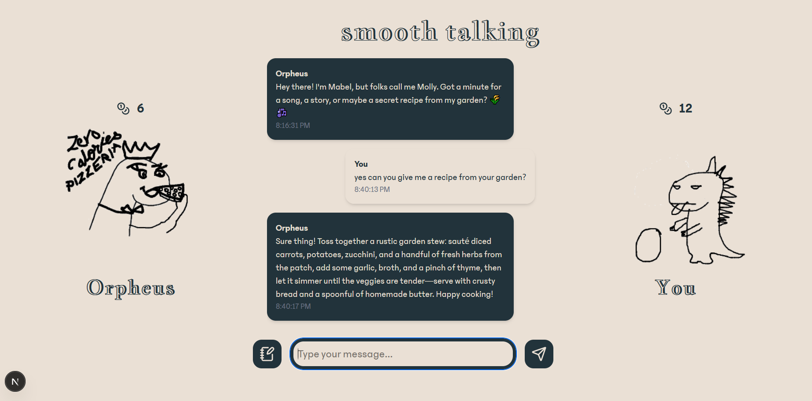

<h1 align="center">
  <br>
  <a href="https://notaroomba.dev"></a>
  <br>
  Smooth Talking
  <br>
</h1>

<h4 align="center">
An AI-Powered Dinosaur Debate Game

</h4>

<div align="center">


</div>

<p align="center">
  <a href="#key-features">Key Features</a> •
  <a href="#getting-started">Getting Started</a> •
  <a href="#screenshots">Screenshots</a> •
  <a href="#credits">Credits</a>
</p>

## Key Features

- **AI-Powered Conversations**: Chat with unique dinosaur personalities
- **Coin System**: Earn coins through strategic conversations
- **User Authentication**: Secure accounts with profile customization
- **Game Sessions**: Save and resume your games
- **Leaderboards**: Compete with other players
- **Responsive Design**: Works on desktop and mobile

Debate with AI dinosaurs to earn coins. Each dinosaur has unique personalities, likes, and dislikes. Earn coins by triggering conversation rules while avoiding topics that might end the game!

Built with Next.js, TypeScript, MongoDB, and OpenAI API.

## Getting Started

### Prerequisites

- Node.js 18+ or Bun
- MongoDB database
- Gmail account for email service

### Installation

1. Clone the repository:

```bash
git clone https://github.com/NotARoomba/SmoothTalking.git
cd SmoothTalking
```

2. Install dependencies:

```bash
bun install
# or
npm install
```

3. Set up environment variables:
   Create a `.env.local` file in the root directory:

```env
MONGODB_URI=your_mongodb_connection_string
EMAIL_USER=your_email@gmail.com
EMAIL_PASS=your_app_password
NEXTAUTH_URL=http://localhost:3000
```

4. Run the development server:

```bash
bun dev
# or
npm run dev
```

5. Open [http://localhost:3000](http://localhost:3000) in your browser

## Screenshots

### Game Interface



## Credits

Built with Next.js, MongoDB, OpenAI, and Tailwind CSS.

## You may also like...

- [Athena](https://github.com/NotARoomba/Athena) – Advanced Flight Computer with Triple MCU Architecture
- [Niveles De Niveles](https://github.com/NotARoomba/NivelesDeNiveles) – Real-time flood alert app
- [Linea](https://github.com/NotARoomba/Linea) – An EMR tablet
- [Tamaki](https://github.com/NotARoomba/Tamaki) – A cute HackPad

## License

MIT

---

> [notaroomba.dev](https://notaroomba.dev) &nbsp;&middot;&nbsp;
> GitHub [@NotARoomba](https://github.com/NotARoomba)
